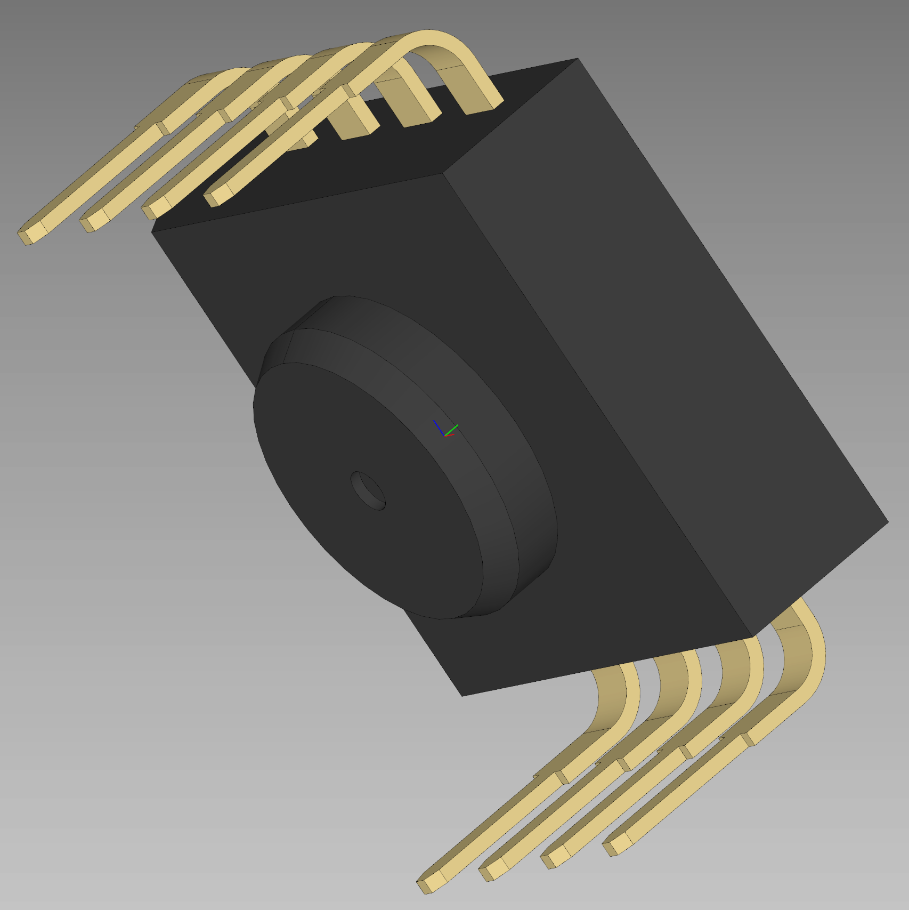
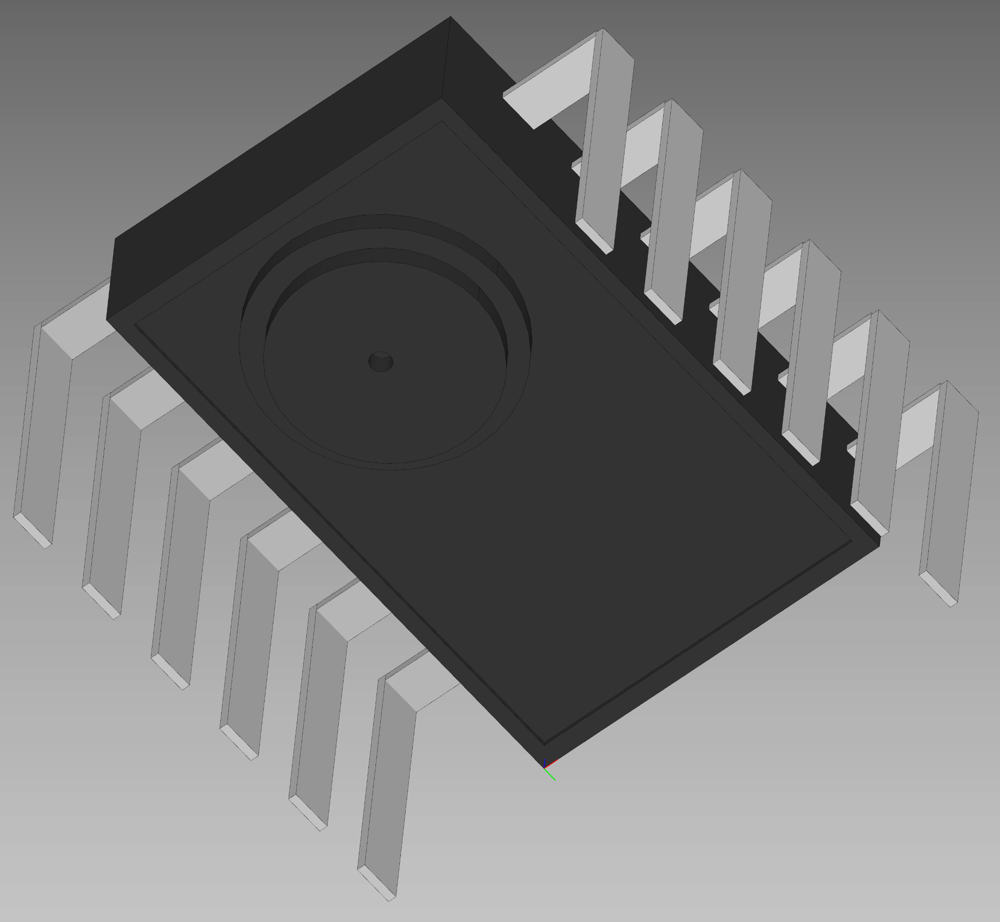
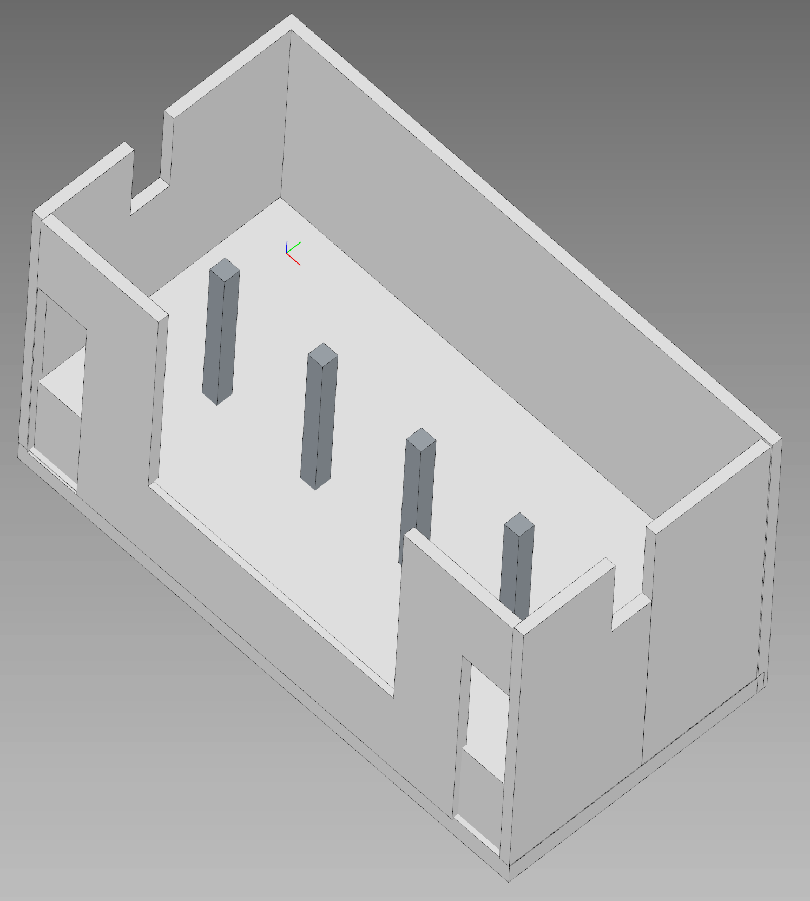
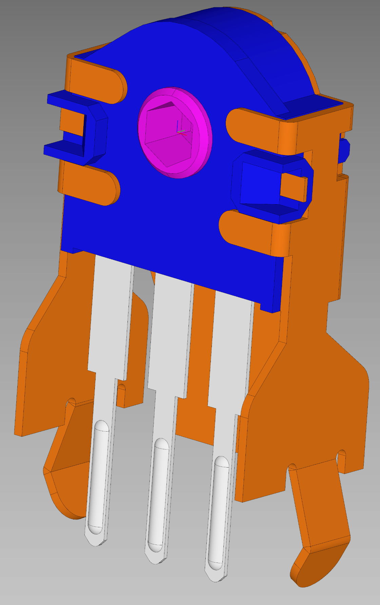
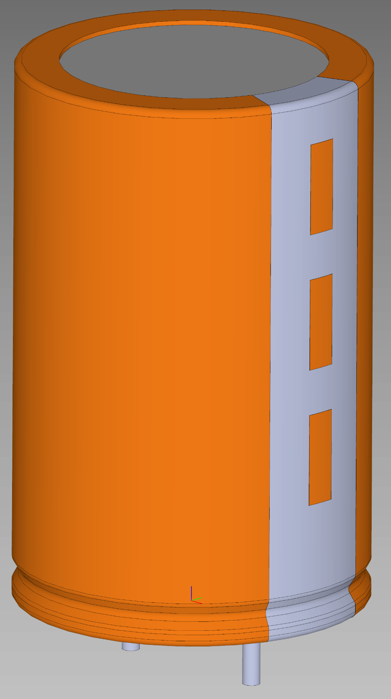
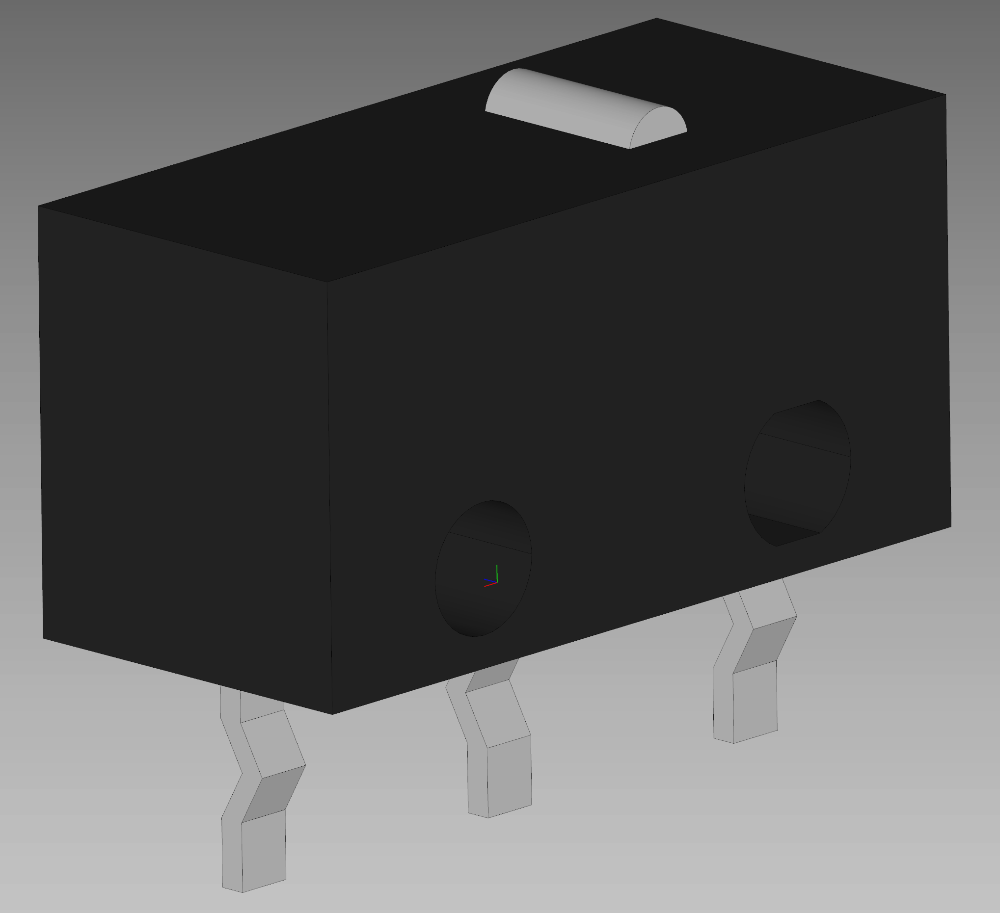
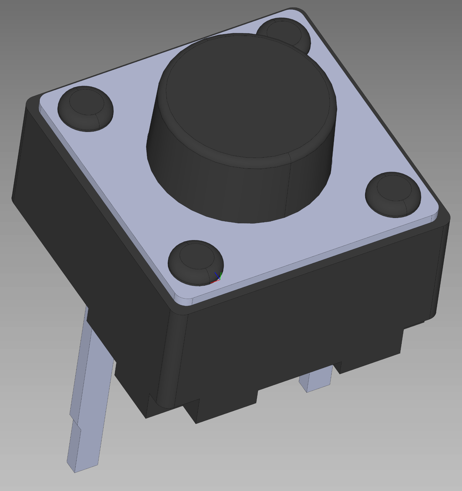
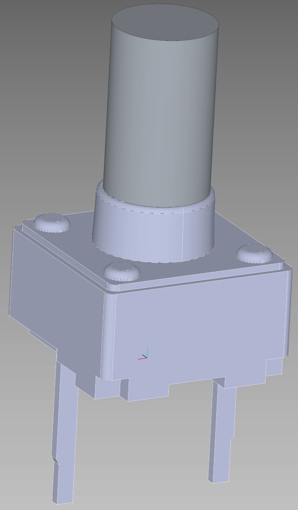

# C0m3b4ck's KiCAD component collection
A collection of KiCAD components that I used in my projects - step models, symbols, docs and footprints, many made by me.
 **Since I am not the author of some components, the collection is under the Unlicense - download and share howerver you like!**
 *It would be nice if you pointed people to this collection though :)*

# List of components
* [ADNS-5050](ADNS-5050.7z) - an optical mouse IC
* [MX8733B](MX8733B.7z) - an optical mouse IC used in the XM102K mouse (model same as ADNS-5050)
* [V101S](V101S_C0m3b4ck.7z) - an optical mouse IC used in the DazzerBlue TRAMYS44940 **(made by me)**
* [4pin male 5mm 10mm C0m3b4ck](4pin_male_5mm_10mm_C0m3b4ck.7z) - 4x1 row of male pins **(made by me)**
* [AlpineRotaryEncoder-EC10E1220503](AlpineRotaryEncoder-EC10E1220503.7z) - a rotary encoder
* [IllinoisCapacitor_r3mm_h8mm](IllinoisCapacitor_r3mm_h8mm.7z) - a radial capacitor
* [Omron-D2F-01-A](Omron-D2F-01-A.7z) - a 3-pin SPDT microswitch
* [SWITCH-BUTT-2pin-small](SWITCH-BUTT-2pin-small.7z) - a small 2-pin pushbutton switch
* [SmallCapacitor.pretty](SmallCapacitor.pretty.7z) - a small capacitor footprint library 
* [BUTT-2--3DModel-STEP-418109](BUTT-2--3DModel-STEP-418109.7z) - a small button
* [BTN 6x6mm 7mm 2-pin C0m3b4ck](btn_6x6mm_7mm_2pin-C0m3b4ck.7z) - a 2-pin 6x6mm 7mm button **(remade by me based on BUTT-2--3DModel-STEP-418109)**

# Images
| | | |
|---|---|---|
| 
 MX8733B optical mouse IC, used in the XM102K mouse.
 | 
 V101S optical mouse IC, used in the DazzerBlue TRAMYS44940.
 | 
 4-pin male header, 4x1 row, 5 mm / 10 mm variant.
 |
| 
 Alpine rotary encoder footprint/model.
 | 
 Illinois radial capacitor, 3 mm radius and 8 mm height.
 | 
 Omron D2F-01-A 3-pin SPDT microswitch.
 |
| 
 Small 2-pin pushbutton switch.
 | 
 2-pin 6x6 mm, 7 mm button remade by C0m3b4ck.
 |  |
